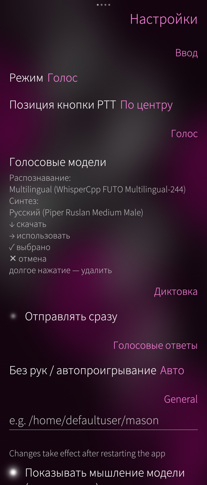
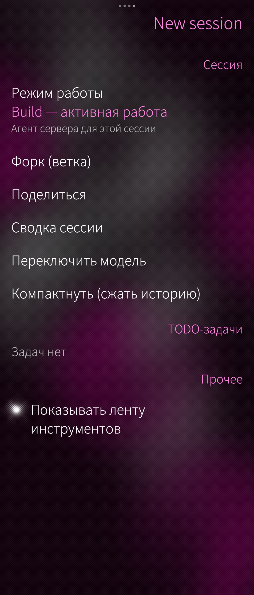
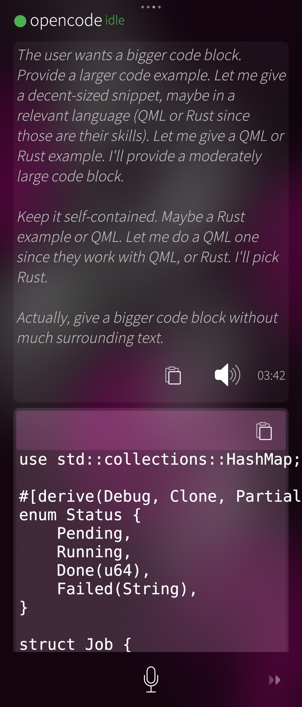

# mason — native opencode client for Sailfish OS

> Codename **mason**; packaged and distributed as **harbour-opencode**.

Native [opencode](https://opencode.ai) client for **Sailfish OS**.

A Rust + QML (Silica) application that speaks the opencode HTTP/SSE server protocol
and lets you drive an opencode agent from your phone: create sessions, chat, review
and approve tool calls, stream assistant output, and use local voice input/output.

Built and tested on a Sony Xperia 10 IV running Sailfish OS 5.1.0.11 (aarch64).

## Screenshots

<table>
  <tr>
    <td align="center"></td>
    <td align="center"></td>
  </tr>
  <tr>
    <td align="center"></td>
    <td align="center"></td>
  </tr>
</table>

## How it works

`mason` runs the opencode agent **entirely in your pocket**. The thinking happens in
the cloud; the work happens on the device:

```
          cloud LLM API (Anthropic / OpenAI / …)
                    ▲   HTTPS + API key
                    │
        ┌───────────┴────────────┐
        │  opencode server        │  ← bundled arm64 binary,
        │  (runs on the phone)    │    started by the client via
        │  sessions · planning    │    `opencode serve` on 127.0.0.1:4096
        └───────────┬────────────┘
             ▲      │  executes tools
   HTTP + SSE│      ▼
        ┌───┴────────────────┐        ┌───────────────────────────┐
        │  harbour-opencode   │        │  phone filesystem, shell,  │
        │  Rust backend + QML │  ───►  │  git — all executed        │
        │  app (the UI)       │approve │  on the device             │
        └─────────────────────┘        └───────────────────────────┘
```

- **Orchestration & execution are local.** The opencode server, its sessions and
  every tool call (files, shell, git) run on the phone, against the phone's own
  filesystem.
- **The model is remote.** The server reaches the configured LLM provider over
  HTTPS with an API key; without network the agent cannot reason.
- **Nothing runs silently.** Every tool call is surfaced as a permission request in
  the UI, so the user stays the approver of what actually executes on the device.

A secondary, future mode is using the same client as a thin console for an
`opencode serve` instance running on a PC (point `OPENCODE_SERVER_URL` at it).

> **API key:** the LLM credentials live on the phone (not in this repo). Do not
> commit them, and treat scripts/config that carry them as secrets.

## Features

- Full opencode session flow over HTTP + SSE (`/session`, `POST /session`,
  `POST /session/{id}/message`, streaming events via SSE).
- Message and tool-event types mirroring the opencode server API
  (`opencode-client/src/types`, `opencode-client/src/event`).
- **Permission flow** — every tool call is presented to the user for approval
  (`opencode-client/src/state/permission.rs`, QML dialogs); commands are never
  executed silently.
- Markdown rendering of assistant replies in chat.
- **Voice**: speech-to-text via local [whisper.cpp](https://github.com/ggml-org/whisper.cpp)
  (STT) and text-to-speech via [piper](https://github.com/rhasspy/piper) (TTS).
  Voice support is compiled behind the `voice` feature and bundled model catalogue
  in `opencode-client/assets/models.json`.
- Localization: Russian, Finnish, German, Ukrainian (`opencode-client/translations`).

## Project layout

```
├── opencode-client/          # Rust application crate
│   ├── src/                  # backend: api, event (SSE), state, bridge, audio
│   ├── qml/                  # Silica UI (ChatPage, Sessions, Settings, VoiceModels)
│   ├── examples/             # smoke tests for voice/guard flows
│   ├── vendor/               # qmetaobject-sfos-rs, sailors (vendored)
│   └── translations/
├── scripts/                  # build / deploy / dev helpers
├── packaging/                # patches (whisper-cli --audio-ctx)
├── rpm/harbour-opencode.spec # RPM spec (MIT)
├── vault/                    # internal design notes
└── mbuild.sh                 # containerized mb2 build
```

The client bundles an arm64 `opencode` CLI binary into the RPM
(`/usr/libexec/harbour-opencode/opencode`) and starts it via `opencode serve`,
so no separate opencode installation is required on the phone.

## Building

Requires Docker with the WhisperFish/`sailo-rs` Rust SDK image
(`registry.gitlab.com/whisperfish/sailo-rs/rust-aarch64-5.1.0.11:sfos-5-1`)
and network access to fetch `whisper.cpp`, `piper` and the `opencode` CLI.

```sh
sg docker -c "./mbuild.sh"            # debug — fast, for development
sg docker -c "./mbuild.sh --release"  # release — optimized
```

Output: `harbour-opencode-0.1-1.aarch64.rpm`.

Alternative non-Docker build via `mb2`: `scripts/build.sh`.

## Deploying to a phone

```sh
scripts/deploy.sh            # scp the debug binary, defaults below
scripts/deploy.sh -r         # scp the release binary
```

Env vars (no credentials are hardcoded in the repo):

- `SFOS_HOST` — phone address (default `172.28.172.1` — USB/network hotspot of the phone)
- `SFOS_USER` — ssh user (default `defaultuser`)
- `SFOS_PASS` — ssh password

Install the RPM on the device: `devel-su rpm -Uvh --force harbour-opencode-0.1-1.aarch64.rpm`.

Dev-only scripts (`restart-probe.sh`, `opencode-client/qml/do-probe.sh`,
`scripts/tts-restart.sh`, …) reuse `devel-su` and read the password from
`SFOS_PASS` as well.

## Voice

- **STT**: local `whisper.cpp` (`whisper-cli`), patched with `--audio-ctx`
  (packaging/whisper-cli-audio-ctx.patch) for fast onboarding.
- **TTS**: `piper`, with a statically built aarch64 runtime bundled by the spec.
- Model catalogue: `opencode-client/assets/models.json`.

## License

MIT. See [LICENSE](LICENSE) and [AUTHORS.md](AUTHORS.md).

## Disclaimer

Not affiliated with Jolla Ltd. or with the opencode project — this is an
independent client that implements the opencode server protocol.
`opencode` is a separate product by its authors (see opencode.ai).